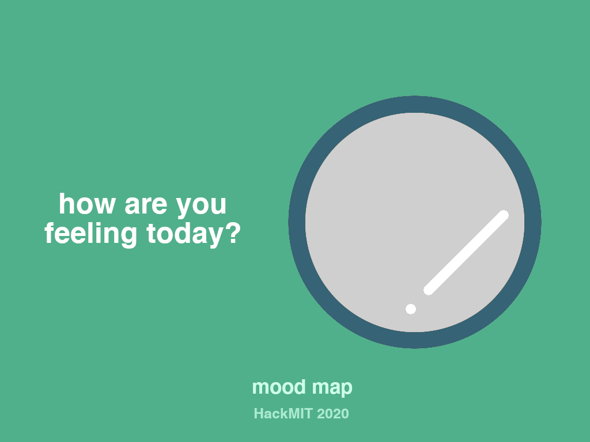

# Mood Map, A Chrome Extension for COVID
The Chrome Extension for Mental Health in the Age of COVID-19.

## Problem
As college students, we've noticed that quarantine has significantly changed our lives. **Our screen time is now higher than ever** as we rely on the Internet for everything from classes to communicating with friends. This means that **it can be hard to find a quick moment** for introspection and self-reflection.
 
## Why Mood Map?
Our web app integrates mood check ups into your daily life in order to reconnect you with your inner emotions. Every time you open up a new tab, Mood Map gives you a moment to reflect on how you, the person sitting in front of the computer, are doing. This gives you a brief respite from the ongoing hustle of Zoom meetings and coursework and everything else you might have going on.

Through Mood Map, **the user can see trends in their moods** over the course of time, helping them to connect with and understand their emotions not only by logging them, but also by **seeing data visualizations**. 
 
## Technologies used

- [Grommet](https://v2.grommet.io) (an accessibility-focused React framework)
- [Firebase](https://firebase.google.com/) (Realtime Database and Authentication)
- [chart.xkcd](https://github.com/timqian/chart.xkcd) (an xkcd-style chart library used for data visualization)
- [React Calendar Heatmap](https://github.com/kevinsqi/react-calendar-heatmap) (used to display mood over the course of recent months)

## Other links

- Feel free to take a look at the [Figma board](https://www.figma.com/file/J8fGf4TZweJL5xlWayeYJB/checkin?node-id=0%3A1) we used to mock everything up!
